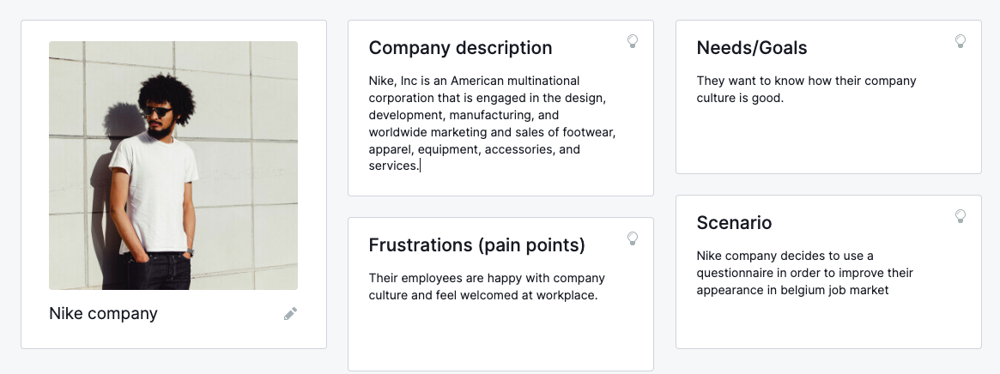
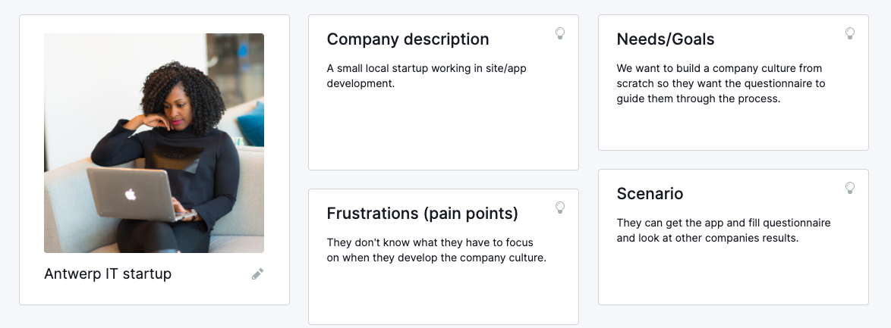
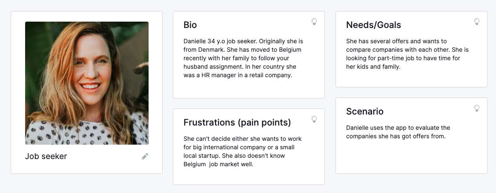

## Nike company

<!-- - **Bio**: International company selling sport wear. 
- **Needs/Goals**: They want to know how their company culture is good. 
- **Frustrations**: Their employees are happy with company culture and feel welcomed at workplace.
- **Scenario**: Nike company decides to use a questionnaire in order to improve their appearance in belgium job market -->

## Antwerp IT company

<!-- - **Bio**: A startup 
- **Needs/Goals**: We want to build a company culture from scratch so they want the questionnaire to guide them through the process.
- **Frustrations**: They don't know what they have to focus on when they develop the company culture.
- **Scenario**: They can get the app and fill questionnaire. -->

## Job seeker

<!-- - **Bio**: Danielle is 34 y.o job seeker. 
- **Needs/Goals**: she has several offers from different companies and wants to compare them between.
- **Frustrations**: she can't decide either he wants to work for big international company or a small local startup. 
- **Scenario**: She uses this app to figure out which company fits better for him. -->